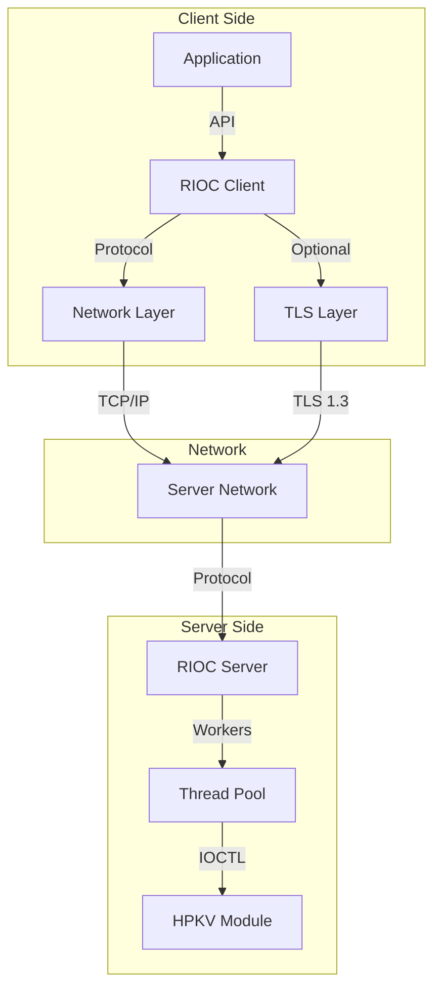
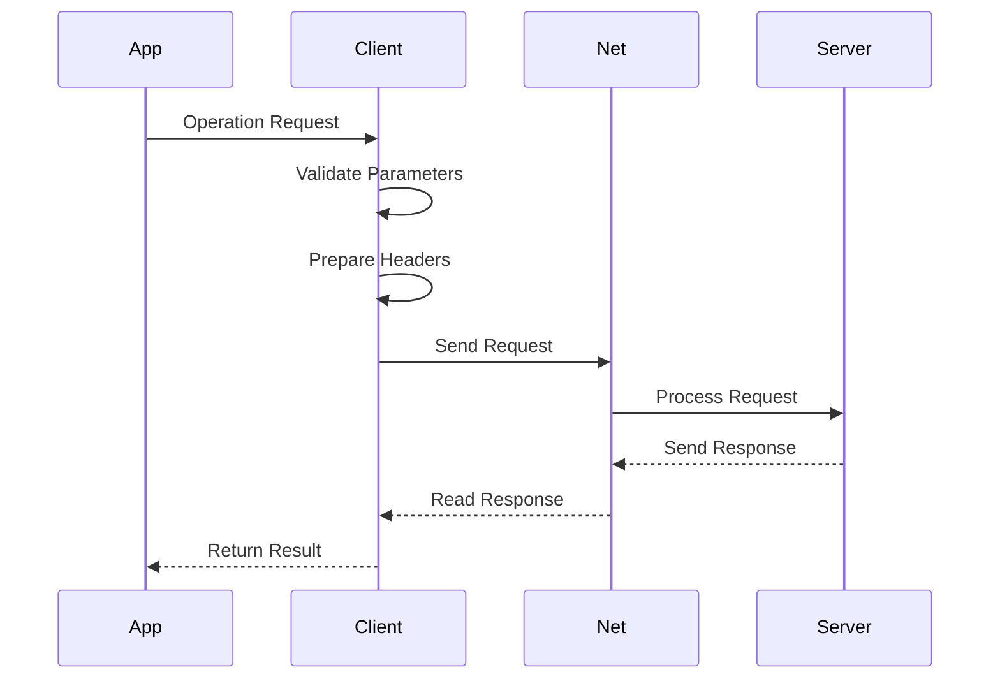
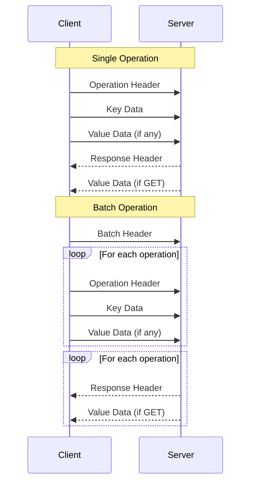
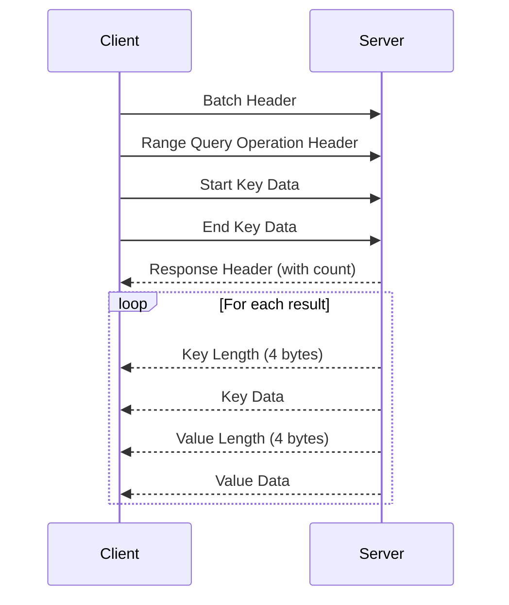
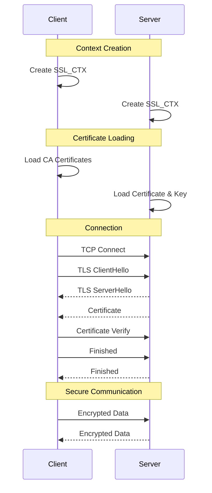
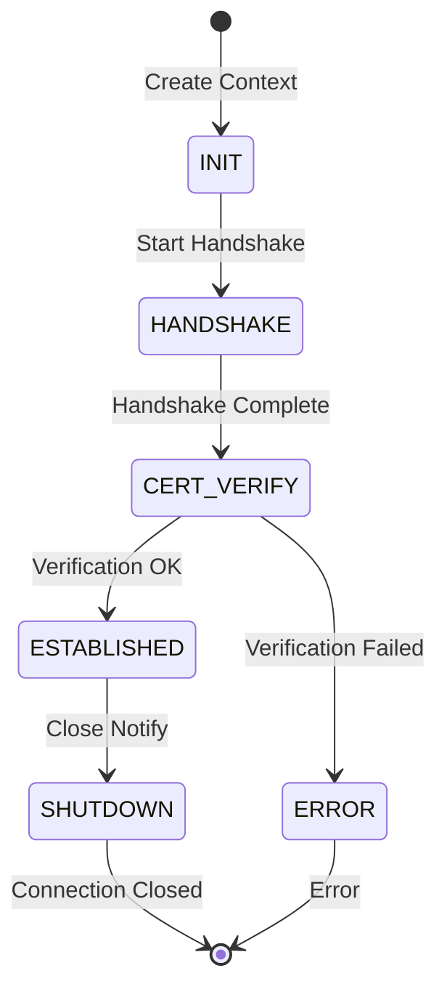
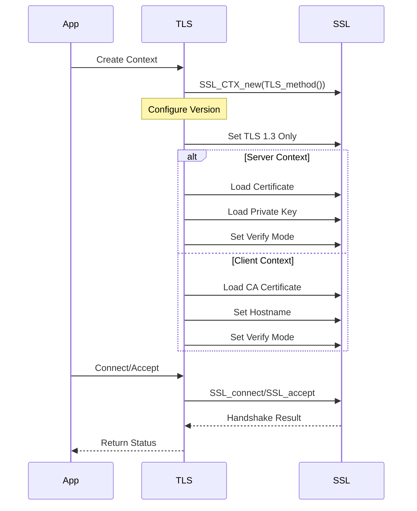

# RIOC (Remote I/O Communication)

## Table of Contents
1. [Introduction](#introduction)
2. [High-Level Architecture](#high-level-architecture)
3. [Core Components](#core-components)
4. [Network Protocol](#network-protocol)
5. [Security and TLS](#security-and-tls)
6. [Operation Flows](#operation-flows)
7. [Performance Considerations](#performance-considerations)
8. [Cross-Platform Support](#cross-platform-support)

## Introduction

RIOC implements a client-server protocol for interfacing with HPKV, focusing on three technical requirements:

1. **Latency and Throughput**: Implementation of zero-copy operations, vectored I/O, and batch processing to minimize per-operation overhead. Network optimizations include TCP_NODELAY and buffer tuning.

2. **Data Consistency**: Implementation of atomic operations, proper memory barriers, and transaction logging. Error handling includes automatic retry mechanisms with exponential backoff.

3. **Transport Security**: TLS 1.3 implementation with certificate-based authentication, perfect forward secrecy, and session key rotation.

Operation modes:
```c
// Command types supported
#define RIOC_CMD_GET            1  // Single key retrieval
#define RIOC_CMD_INSERT         2  // Key-value insertion
#define RIOC_CMD_DELETE         3  // Key removal
#define RIOC_CMD_PARTIAL_UPDATE 4  // Partial value update
#define RIOC_CMD_BATCH          5  // Multiple operations
#define RIOC_CMD_RANGE_QUERY    6  // Key range retrieval
#define RIOC_CMD_ATOMIC_INC_DEC 7  // Atomic increment/decrement
```

## High-Level Architecture

RIOC implements a client-server architecture for efficient key-value operations. The system consists of these main components:

1. **Client Library**: Implements the client-side protocol and API
2. **Server Component**: Manages connections and HPKV device interaction
3. **Protocol Layer**: Binary protocol with fixed headers and data sections
4. **TLS Layer**: Optional secure communication layer

Component interaction:



### Key Design Aspects

1. **Protocol Design**
   - Fixed-size headers for efficient parsing
   - Variable-length data sections
   - Batch operation support
   - Protocol versioning

2. **Threading Model**
   - Multi-threaded server with worker pool
   - Thread-per-client connection handling
   - Non-blocking I/O operations

3. **Security Model**
   - Optional TLS 1.3 support
   - Certificate-based authentication
   - Mutual authentication support

### Implementation Constraints

1. **Size Limits**
   ```c
   #define RIOC_MAX_BATCH_SIZE  128   // Maximum operations per batch
   #define RIOC_MAX_IOV 3           // Maximum I/O vectors per operation
   ```

2. **Protocol Constants**
   ```c
   #define RIOC_VERSION    2       // Protocol version
   #define RIOC_MAGIC      0x524F4943  // "RIOC"
   ```

## Core Components

### Client Implementation

The client component provides a minimal interface for interacting with the RIOC server. The core client structure is:

```c
struct rioc_client {
    int fd;             // Socket file descriptor
    uint64_t sequence;  // Operation sequence number
    struct rioc_tls_context *tls; // TLS context, NULL if not using TLS
};
```

The client can be configured using:
```c
typedef struct rioc_client_config {
    const char* host;           // Server hostname
    uint32_t port;             // Server port
    uint32_t timeout_ms;       // Operation timeout in milliseconds
    rioc_tls_config* tls;      // Optional TLS config
} rioc_client_config;
```

Operation flow:



### Batch Processing

The batch system optimizes throughput by grouping operations. Core structures:

```c
struct rioc_batch_op {
    struct rioc_op_header header;
    char key[RIOC_MAX_KEY_SIZE];
    char *value_ptr;  // Value data pointer
    size_t value_offset;    // Offset in batch buffer
    struct rioc_response response;
    struct iovec iov[RIOC_MAX_IOV];  // Pre-allocated IOVs
} __attribute__((aligned(RIOC_CACHE_LINE_SIZE)));

struct rioc_batch {
    struct rioc_client *client;
    struct rioc_batch_header batch_header;
    struct rioc_batch_op ops[RIOC_MAX_BATCH_SIZE];
    char *value_buffer;     // Single buffer for all values
    size_t value_buffer_size;
    size_t value_buffer_used;
    size_t count;
    size_t iov_count;
    uint32_t flags;
} __attribute__((aligned(RIOC_CACHE_LINE_SIZE)));
```

### Range Query Support

The range query feature allows retrieval of all key-value pairs within a specified key range:

```c
struct rioc_range_result {
    char *key;
    size_t key_len;
    char *value;
    size_t value_len;
};

// Perform a range query
int rioc_range_query(struct rioc_client *client, 
                    const char *start_key, size_t start_key_len,
                    const char *end_key, size_t end_key_len, 
                    struct rioc_range_result **results, size_t *result_count);

// Free the results when done
void rioc_free_range_results(struct rioc_range_result *results, size_t count);
```

### Atomic Operations

The library supports atomic operations for counter management:

```c
// Atomically increment or decrement a value
int rioc_atomic_inc_dec(struct rioc_client *client, const char *key, size_t key_len,
                      int64_t increment, uint64_t timestamp, int64_t *result);

// Add atomic operation to batch
int rioc_batch_add_atomic_inc_dec(struct rioc_batch *batch, const char *key, size_t key_len,
                               int64_t increment, uint64_t timestamp);
```

## Network Protocol

The protocol implements a binary message format with fixed-size headers and variable-length data sections.

### Message Headers

1. **Operation Header**
   ```c
   struct rioc_op_header {
       uint16_t command;    // Operation type
       uint16_t key_len;    // Key length
       uint32_t value_len;  // Value length
       uint64_t timestamp;  // Operation timestamp
   };
   ```

2. **Batch Header**
   ```c
   struct rioc_batch_header {
       uint32_t magic;      // Protocol magic (0x524F4943)
       uint16_t version;    // Protocol version (2)
       uint16_t count;      // Number of operations
       uint32_t flags;      // Operation flags
   };
   ```

3. **Response Header**
   ```c
   struct rioc_response_header {
       uint32_t status;     // Operation status
       uint32_t value_len;  // Length of value (for GET)
   };
   ```

### Protocol Flags

```c
#define RIOC_FLAG_ERROR    0x1    // Operation failed
#define RIOC_FLAG_PIPELINE 0x2    // Enable pipelining
#define RIOC_FLAG_MORE     0x4    // More operations follow
```

### Message Flow



### Range Query Protocol

For range queries, the protocol extends the standard flow:



## Security and TLS

RIOC implements TLS 1.3 support using OpenSSL for secure communication between clients and servers. The implementation focuses on simplicity and security:

### TLS Configuration

The TLS layer can be configured through a simple structure:

```c
typedef struct rioc_tls_config {
    const char* cert_path;        // Server cert or client CA cert path
    const char* key_path;         // Server private key path (server only)
    const char* ca_path;          // CA certificate path (client only)
    const char* verify_hostname;  // Hostname to verify (client only)
    bool verify_peer;            // Enable certificate verification
} rioc_tls_config;
```

This configuration can be provided to clients:

```c

// Client configuration with TLS
rioc_client_config client_cfg = {
    .host = "localhost",
    .port = 8443,
    .timeout_ms = 5000,
    .tls = &tls_cfg  // Optional TLS configuration
};
```

### TLS Implementation

The TLS implementation uses a straightforward context structure:

```c
struct rioc_tls_context {
    SSL_CTX *ctx;      // OpenSSL context
    SSL *ssl;          // OpenSSL connection
};
```

The TLS flow follows standard OpenSSL patterns:



### Security Features

1. **TLS Version Control**
   ```c
   // Force TLS 1.3 only
   SSL_CTX_set_min_proto_version(ctx, TLS1_3_VERSION);
   SSL_CTX_set_max_proto_version(ctx, TLS1_3_VERSION);
   ```

2. **Certificate Verification**
   ```c
   // Enable peer verification
   if (config->verify_peer) {
       SSL_CTX_set_verify(ctx, SSL_VERIFY_PEER | 
                              SSL_VERIFY_FAIL_IF_NO_PEER_CERT, NULL);
   }
   ```

3. **Hostname Verification**
   ```c
   // Set hostname for verification (client only)
   if (config->verify_hostname) {
       SSL_set_tlsext_host_name(ssl, config->verify_hostname);
   }
   ```

### TLS Operations

The TLS layer provides basic I/O operations:

```c
// Read operation
ssize_t rioc_tls_read(struct rioc_tls_context *tls, void *buf, size_t len);

// Write operation
ssize_t rioc_tls_write(struct rioc_tls_context *tls, const void *buf, size_t len);

// Vectored I/O operations
int rioc_tls_readv(rioc_tls_context *tls_ctx, struct iovec *iov, int iovcnt);
int rioc_tls_writev(rioc_tls_context *tls_ctx, const struct iovec *iov, int iovcnt);
```

These operations handle:
- Proper error checking
- Partial reads/writes
- SSL state management
- Error propagation

### TLS State Machine

The TLS implementation follows this state machine for connections:



### TLS Initialization Flow

The initialization process for TLS contexts:



## Operation Flows

RIOC implements three main operation patterns: single operations, batch operations, and asynchronous batch operations.

### Single Operations

Single operations provide direct key-value access with these steps:

1. **Parameter Validation**
   ```c
   if (!client || !key || key_len > RIOC_MAX_KEY_SIZE || 
       (value && value_len > RIOC_MAX_VALUE_SIZE)) {
       return RIOC_ERR_PARAM;
   }
   ```

2. **Request Transmission**
   ```mermaid
   sequenceDiagram
       participant A as Application
       participant C as Client
       participant S as Server
       
       A->>C: rioc_get/insert/delete
       C->>C: Validate Parameters
       C->>S: Send Operation Header
       C->>S: Send Key
       opt Has Value
           C->>S: Send Value
       end
       S-->>C: Response Header
       opt Is GET
           S-->>C: Value Data
       end
       C-->>A: Return Result
   ```

3. **Response Processing**
   - Synchronous wait for response
   - Error code propagation
   - Memory management for GET results

### Batch Operations

Batch operations optimize throughput by grouping requests:

1. **Batch Creation**
   ```mermaid
   sequenceDiagram
       participant A as Application
       participant B as Batch
       
       A->>B: rioc_batch_create
       B->>B: Allocate Structures
       B->>B: Initialize Headers
       A->>B: Add Operations
       Note over B: Buffer until full/flush
   ```

2. **Operation Buffering**
   - Operations are added to batch
   - Shared value buffer for efficiency
   - Automatic flush when full

3. **Execution**
   ```mermaid
   sequenceDiagram
       participant B as Batch
       participant S as Server
       
       B->>S: Batch Header
       loop Each Operation
           B->>S: Operation Header
           B->>S: Key Data
           opt Has Value
               B->>S: Value Data
           end
       end
       loop Each Response
           S-->>B: Response Header
           opt Is GET
               S-->>B: Value Data
           end
       end
   ```

### Asynchronous Operations

The asynchronous batch interface provides non-blocking operation:

1. **Execution**
   ```c
   // Start async execution
   struct rioc_batch_tracker* tracker = rioc_batch_execute_async(batch);
   
   // Check completion
   int ret = rioc_batch_wait(tracker, timeout_ms);
   
   // Get results
   for (size_t i = 0; i < batch->count; i++) {
       char *value;
       size_t value_len;
       ret = rioc_batch_get_response_async(tracker, i, &value, &value_len);
   }
   ```

2. **Completion Tracking**
   - Non-blocking response processing
   - Timeout handling
   - Per-operation result access

3. **Resource Management**
   - Automatic cleanup on completion
   - Memory management for GET results
   - Error state preservation

### Range Query Operations

Range queries follow a similar pattern to single operations:

1. **Range Execution**
   ```c
   char *start_key = "user:1000";
   char *end_key = "user:2000";
   
   // Perform the range query
   struct rioc_range_result *results;
   size_t count;
   int ret = rioc_range_query(client, start_key, strlen(start_key),
                              end_key, strlen(end_key), 
                              &results, &count);
   
   // Process results
   for (size_t i = 0; i < count; i++) {
       // Use results[i].key, results[i].value
   }
   
   // Free results when done
   rioc_free_range_results(results, count);
   ```

2. **Batch Range Queries**
   ```c
   struct rioc_batch *batch = rioc_batch_create(client);
   
   // Add a range query to the batch
   rioc_batch_add_range_query(batch, start_key, strlen(start_key),
                              end_key, strlen(end_key));
   
   // Execute the batch asynchronously
   struct rioc_batch_tracker* tracker = rioc_batch_execute_async(batch);
   ```

## Performance Considerations

RIOC implements several key optimizations to achieve high performance:

### Network Optimizations

1. **Socket Configuration**
   The implementation configures TCP sockets for optimal performance:
   ```c
   // Disable Nagle's algorithm
   int flag = 1;
   setsockopt(fd, IPPROTO_TCP, TCP_NODELAY, &flag, sizeof(flag));
   
   // Set buffer sizes
   int buf_size = RIOC_TCP_BUFFER_SIZE;  // 1MB
   setsockopt(fd, SOL_SOCKET, SO_SNDBUF, &buf_size, sizeof(buf_size));
   setsockopt(fd, SOL_SOCKET, SO_RCVBUF, &buf_size, sizeof(buf_size));
   ```

2. **Vectored I/O**
   Uses writev/readv for efficient data transfer:
   ```c
   struct iovec iov[RIOC_MAX_IOV];  // header + key + value
   iov[0].iov_base = header;
   iov[0].iov_len = sizeof(*header);
   iov[1].iov_base = key;
   iov[1].iov_len = key_len;
   writev(fd, iov, iov_count);
   ```

3. **TCP Fast Path Optimizations**
   Uses TCP_CORK (Linux) or TCP_NOPUSH (macOS) for better packet coalescing:
   ```c
   // Enable packet coalescing (platform-specific)
   #ifdef RIOC_PLATFORM_LINUX
   int flag = 1;
   setsockopt(fd, IPPROTO_TCP, TCP_CORK, &flag, sizeof(flag));
   #elif defined(RIOC_PLATFORM_MACOS)
   int flag = 1;
   setsockopt(fd, IPPROTO_TCP, TCP_NOPUSH, &flag, sizeof(flag));
   #endif
   ```

### Memory Management

1. **Cache Line Alignment**
   Critical structures are aligned to prevent false sharing:
   ```c
   struct rioc_batch {
       // ... fields ...
   } __attribute__((aligned(RIOC_CACHE_LINE_SIZE)));
   ```

2. **Buffer Reuse**
   The batch system reuses buffers to minimize allocations:
   ```c
   struct rioc_batch_op {
       char *value_ptr;     // Points into shared value buffer
       size_t value_offset; // Offset in shared buffer
   };
   ```

3. **Prefetching**
   Strategic data prefetching for better cache utilization:
   ```c
   // Prefetch data that will be used soon
   __builtin_prefetch(next_buffer, 0, 3);
   ```

### Batch Processing

1. **Operation Coalescing**
   Multiple operations are grouped into a single network transaction:
   ```c
   #define RIOC_MAX_BATCH_SIZE  128   // Operations per batch
   #define RIOC_MAX_IOV 3           // Vectors per operation
   ```

2. **Shared Buffers**
   Batch operations share a single value buffer:
   ```c
   struct rioc_batch {
       char *value_buffer;     // Shared buffer for all values
       size_t value_buffer_size;
       size_t value_buffer_used;
   };
   ```

## Cross-Platform Support

RIOC is designed to operate efficiently across multiple platforms including Linux, macOS, and Windows.

### Platform Abstraction

The implementation uses platform abstraction layers:

```c
// Platform detection
#if defined(_WIN32) || defined(_WIN64)
    #define RIOC_PLATFORM_WINDOWS
#elif defined(__linux__) && !defined(RIOC_PLATFORM_LINUX)
    #define RIOC_PLATFORM_LINUX
#elif defined(__APPLE__) && !defined(RIOC_PLATFORM_MACOS)
    #define RIOC_PLATFORM_MACOS
#else
    #define RIOC_PLATFORM_POSIX
#endif
```

### Socket API Abstraction

Socket operations are abstracted for cross-platform compatibility:

```c
// Socket types and constants
#ifdef RIOC_PLATFORM_WINDOWS
    typedef SOCKET rioc_socket_t;
    #define RIOC_INVALID_SOCKET INVALID_SOCKET
    #define RIOC_SOCKET_ERROR SOCKET_ERROR
#else
    typedef int rioc_socket_t;
    #define RIOC_INVALID_SOCKET (-1)
    #define RIOC_SOCKET_ERROR (-1)
#endif

// Unified socket operations
rioc_socket_t rioc_socket_create(void);
int rioc_socket_close(rioc_socket_t socket);
ssize_t rioc_send(rioc_socket_t socket, const void* buf, size_t len, int flags);
ssize_t rioc_recv(rioc_socket_t socket, void* buf, size_t len, int flags);
```

### Threading and Synchronization

Threading operations support cross-platform threading models:

```c
// Thread affinity (where supported)
int rioc_pin_thread_to_cpu(int cpu);

// Platform-specific optimizations
#ifdef RIOC_PLATFORM_MACOS
    #define RIOC_USE_DISPATCH_SEMAPHORE 1
#endif
```

### Error Codes and Constants

Error codes are normalized across platforms:

```c
// Normalized error codes
#ifdef RIOC_PLATFORM_WINDOWS
    #define RIOC_EINTR WSAEINTR
    #define RIOC_EAGAIN WSAEWOULDBLOCK
    #define RIOC_EWOULDBLOCK WSAEWOULDBLOCK
#else
    #define RIOC_EINTR EINTR
    #define RIOC_EAGAIN EAGAIN
    #define RIOC_EWOULDBLOCK EWOULDBLOCK
#endif
```

## Error Handling

RIOC provides error handling through status codes and error propagation:

1. **Error Codes**
   ```c
   // Core error codes
   #define RIOC_SUCCESS     0    // Operation successful
   #define RIOC_ERR_PARAM  -1    // Invalid parameters
   #define RIOC_ERR_MEM    -2    // Memory allocation failed
   #define RIOC_ERR_IO     -3    // I/O error
   #define RIOC_ERR_PROTO  -4    // Protocol error
   #define RIOC_ERR_DEVICE -5    // Device error
   #define RIOC_ERR_NOENT  -6    // Key not found
   #define RIOC_ERR_BUSY   -7    // System busy
   #define RIOC_ERR_OVERFLOW -8  // Buffer overflow
   ```

2. **Error Propagation**
   Errors are propagated through return values:
   ```c
   // Example error propagation
   int ret = rioc_batch_wait(tracker, timeout_ms);
   if (ret != RIOC_SUCCESS) {
       // Handle error
       return ret;
   }
   ```

3. **Operation Status**
   Each operation's status is tracked:
   ```c
   struct rioc_response_header {
       uint32_t status;     // Operation status
       uint32_t value_len;  // Length of value (for GET)
   };
   ```